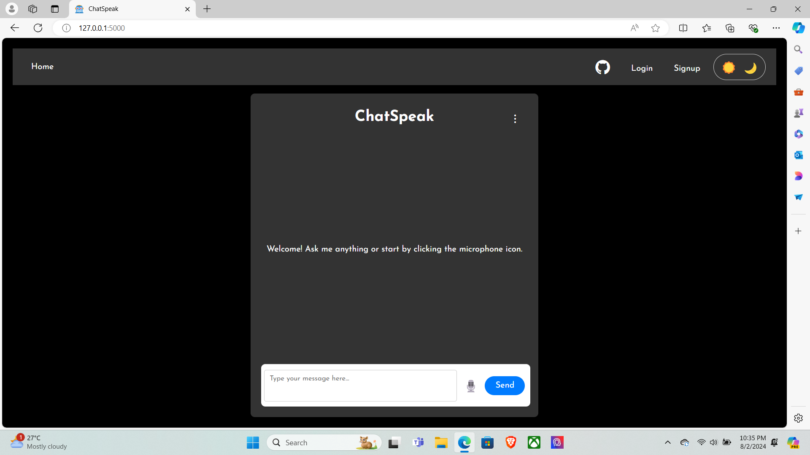
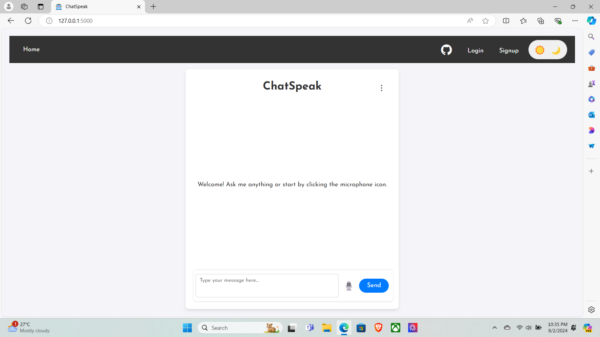

# ChatSpeak 🤖

ChatSpeak is an interactive conversational AI application designed to enhance user communication through both text and voice inputs. This project integrates advanced text and speech technologies to offer a seamless and engaging experience. Users can interact with the bot either by typing their messages or speaking directly into their devices.


<br> <br> <br> 


## Key Features 😎

- **Text Communication:** Users can type messages to the bot and receive immediate, contextually relevant responses.
- **Voice Interaction:** By utilizing Speech-to-Text (STT) technology, users can speak to the bot, which will transcribe their spoken words into text for processing.
- **Text-to-Speech (TTS):** The bot can convert its text responses into speech, allowing users to hear the bot’s replies, enhancing the interactivity of the conversation.
- **Dynamic Theme Toggle:** Users have the option to switch between light and dark themes for a personalized visual experience.

## Technologies 🖥️

- **Backend:** Developed using Flask (Python), which manages API requests and interactions.
- **STT:** Employs the `speech_recognition` library to transcribe audio input into text.
- **TTS:** Utilizes `pyttsx3` for converting text responses into spoken audio.
- **Frontend:** Crafted with HTML, CSS, and JavaScript to deliver an intuitive user interface.

## How to Use 🚀

1. **Clone the Repository:**
   ```bash
   git clone https://github.com/iamrishu11/ChatSpeak.git
   ```

2. **Navigate to Repository:**
   ```bash
   cd ChatSpeak
   ```

3. **Set up Virtual Environment:**
   ```bash
   python -m venv venv
   source venv/bin/activate  # On Windows, use `venv\Scripts\activate`
   ```

4. **Install Dependencies:**
   ```bash
   pip install -r requirements.txt
   ```

5. **Run the Application**
   ```bash
   python app.py
   ```

Access the app locally at http://127.0.0.1:5000 or from other devices on the same network using your local IP address.

## Project Structure 📂

This project is as structured as follows:
   ```bash
   ChatSpeak/
   │
   ├── app.py                # Main application file
   ├── bot.py                # loop bot logic
   ├── burt.py               # Bot file for app.py
   ├── chat_history.db       # Database file to store the chat history
   ├── config.json           # Configuration file for the bot
   ├── models.py             # Defines the database Schema
   ├── requirements.txt      # List of project dependencies
   │
   ├── templates/            # HTML templates for rendering views
   │   └── index.html        # Main HTML file
   │
   ├── static/               # Static files (CSS, JavaScript, images, etc.)
   │   ├── favicon.ico       # Favicon for the web app
   │   ├── styles.css        # CSS stylesheets
   │   └── script.js         # JavaScript files
   │
   ├── test/                 # Test-related files
   │   ├── base64_test.js    # JS logic for testing base64 encoder
   │   ├── cURL-testing.txt  # Text file with cURL commands or test data       
   │   ├── test.html         # HTML files for testing
   │   ├── test.py           # Python scripts for testing
   │   ├── test2.py          # Python scripts for testing
   │   └── TESTin.html       # tesing base64 encoder
   │
   ├── __pycache__/          # Compiled Python files
   │   ├── app.cpython-312.pyc
   │   ├── bot.cpython-312.pyc
   │   ├── burt.cpython-312.pyc
   │   └── test.cpython-312.pyc
   │
   ├── .gitignore            # Specifies files and directories to ignore in Git
   ├── README.md             # Project overview and documentation
   └── LICENSE               # License for the project
   ```

## Project Workflow 🛠️

1. User Interaction
- **Page Load**: The client-side JavaScript initializes and applies the current theme.
- **Text Input**: Users submit text through the input field, triggering text processing.
- **Audio Recording**: Users record audio via the microphone icon, which is then processed.

2. Client-Side JavaScript
- **Process Text Input**: Sends text to the server, displays the response, and plays audio.
- **Record and Process Audio**: Records audio, plays the recorded audio, recognize the text, and displays recognized text.
- **Handles audio playback**: Convert the response from bot to audio and play it.
- **Export Chat History as TXT**: Exports chat history to a TXT file if there are messages, when required.
- **Export Chat History as Database**: Exports chat history to a Database file if there are messages ,when required.

3. Server-Side (Flask)
- **Process Text**: Processes text input, generates a response, and returns text and audio.
- **Export Chat History as TXT**: Creates a TXT file from chat history with timestamps and provides it for download.
- **Export Chat History as Database**: Exports chat history to a Database file and provides it for download.

4. Error Handling and User Feedback
- **Client-Side Errors**: Handles and displays errors during processing and export.
- **Server-Side Errors**: Logs errors and returns HTTP status codes with messages.

## User Interaction Flow 📈

### 1. Page Load

- **Action:** The user navigates to the web application.
- **System Response:**
  - The server sends the HTML, CSS, and JavaScript files to the client.
  - The client-side JavaScript initializes the application, loading the current theme (light or dark) and setting up any necessary event listeners for user interactions.

### 2. User Interacts with the Interface

#### 2.1. Text Input

- **Action:** The user types a message into the text input field and clicks the "Send" button or press 'Enter'.
- **System Response:**
  - JavaScript captures the text input and sends it to the server via a POST request to the `/process_text` endpoint.
  - **Server-Side Processing:**
    - The server receives the text, processes it, and generates a response.
    - The server returns the response in JSON format.
  - **Client-Side Processing:**
    - JavaScript receives the response and updates the chat interface with the new message.
    - If text-to-speech (TTS) is enabled, JavaScript converts the response into audio and plays it for the user.

#### 2.2. Voice Input

- **Action:** The user clicks the "Record" button to start recording a voice message.
- **System Response:**
  - JavaScript captures the audio input from the user's microphone and sends it to the server for Speech-to-Text (STT) processing.
  - **Server-Side Processing:**
    - The server receives the audio, transcribes it into text using STT technology, and processes the text to generate a response.
    - The server returns the response (both text and audio, if applicable) in JSON format.
  - **Client-Side Processing:**
    - JavaScript displays the transcribed text in the chat interface.
    - If text-to-speech (TTS) is enabled, JavaScript converts the response into audio and plays it for the user.

### 3. Export Chat History

#### 3.1. Export as TXT

- **Action:** The user clicks the "Export as TXT" button.
- **System Response:**
  - JavaScript sends a POST request to the `/export_txt` endpoint.
  - **Server-Side Processing:**
    - The server compiles the conversation history into a text file with timestamps.
    - The server returns the file for download.
  - **Client-Side Processing:**
    - The browser downloads the TXT file and saves it to the user's device.

#### 3.2. Export as Database

- **Action:** The user clicks the "Export as Database" button.
- **System Response:**
  - JavaScript sends a POST request to the `/export_db` endpoint.
  - **Server-Side Processing:**
    - The server creates a SQLite database file containing the conversation history.
    - The server returns the database file for download.
  - **Client-Side Processing:**
    - The browser downloads the SQLite database file and saves it to the user's device.

### 4. Error Handling and User Feedback

- **Action:** Errors may occur during interactions, such as network issues or server errors.
- **System Response:**
  - **Client-Side Error Handling:**
    - JavaScript catches and displays error messages to the user in the chat interface or a popup.
  - **Server-Side Error Logging:**
    - The server logs errors for troubleshooting and sends appropriate HTTP status codes and messages to the client.

### 5. Theme Toggle

- **Action:** The user clicks the "Toggle Theme" button to switch between light and dark themes.
- **System Response:**
  - JavaScript updates the theme of the application by applying the corresponding CSS styles.
  - The new theme settings are applied immediately, providing visual feedback to the user.

This User Interaction Flow provides a comprehensive overview of how users interact with the ChatSpeak application and how the system responds to their actions. This flow ensures that users have a seamless and engaging experience, whether they are interacting through text or voice.

## API Endpoints 🔌

- **POST /process_text:** Send text messages to the bot and receive text responses.
- **POST /export_txt:** It lets you export your conversation history in 'txt' file.
- **POST /export_db:** It lets you export your conversation history in 'database' file.

## Contributing 🤝

We welcome contributions to enhance ChatSpeak! To contribute:

- **Open an Issue:** Report bugs or request features.
- **Submit a Pull Request:** Propose changes or improvements.

Please follow the contribution guidelines provided in the repository.

## LICENSE 🧾

This project is licensed under the [MIT License](LICENSE).

## Contact 💬

For any inquiries, please contact [ME](mailto:rishankj749@gmail.com).


